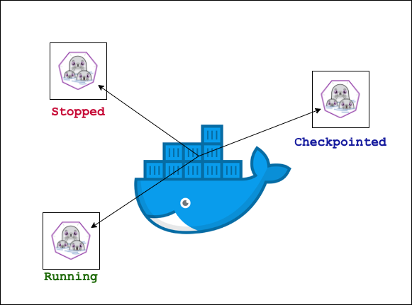
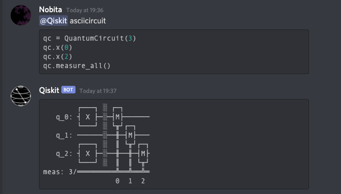
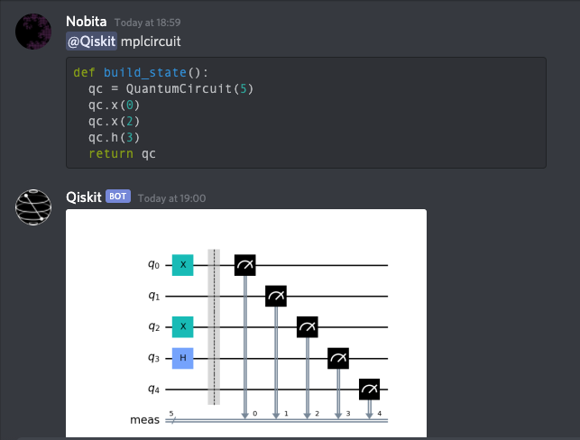
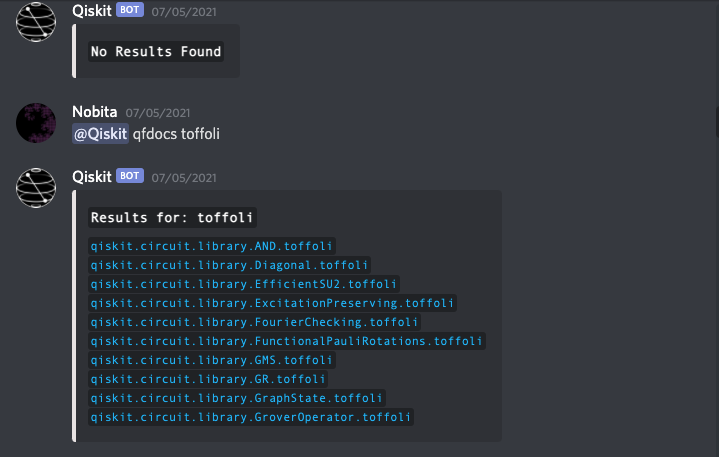
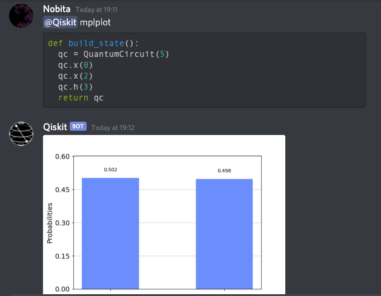
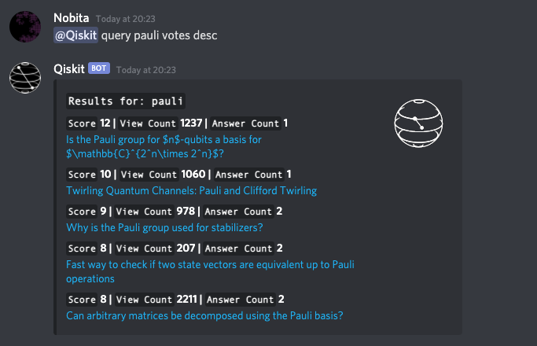

# QiskitBot

A discord bot that allows you to execute [Quantum Circuits](https://qiskit.org/documentation/stubs/qiskit.circuit.QuantumCircuit.html), look up the [IBMQ Qiskit's Documentation](https://qiskit.org/documentation/), and search questions on the [Quantum Computing StackExchange](https://quantumcomputing.stackexchange.com/) 

\
:two_hearts: Qiskit Community 

This project is not affiliated with IBM in any way. But I would like to thank Brian Ingmanson (Education Community Manager at IBM) for being so encouraging and supportive towards this little project!

## Installation

Using docker-compose:

```
docker-compose up --build 
```
Manually from the Dockerfile
```
docker build -t qiskitbot . 
docker run --privileged -i -t qiskitbot 
```
On MacOs with deploy.sh
```
zsh deploy.sh
```
## Disclaimer

Builds might fail on your machine. This is still under testing and there is a lot that needs to be fixed with the way the code is structured. Once everything is smooth, I will add docstrings and comments wherever neccessary. This was just a hobby project, but I do plan on extending it further. 

## Architecture of the sandbox (running untrusted code)
### Goal
Spawn a container per user, providing an isolated environment to run untrusted code. Save the state of the user using [CRIU](https://criu.org/Main_Page) (checkpoint and restore).


### Nested Containers
One of the main objectives of this project was to experiment with the idea of having containers inside of containers. Instead of mounting the unix socket and the spawning containers (the tradional way):
```
docker run -v /var/run/docker.sock:/var/run/docker.sock ...
```
I used podman inside of docker, which is a daemonless container engine used for developing, managing, and running OCI Containers. Podman is used with tools like Buildah and Skopeo, which not only makes managing images and containers easy but in my opinion much more powerful than docker!

### Initial Idea - Using NsJail With Podman Containers
To use podman inside docker you need to use the `--privileged` flag while running your container. This works just fine, but the problem arises when the capabilities of podman and docker don't match. This means you can't run privileged podman containers inside of a docker container as required by NsJail. 
`"CAP_PERFMON","CAP_BPF", "CAP_CHECKPOINT_RESTORE"` are not supported by docker. 
See issue [#10282 on containers/podman](https://github.com/containers/podman/issues/10282)
Eventually after a lot of experimentation, I dropped this idea. (refer to the Dockerfile in the root directory)

## Usage
```
<@Qiskit>asciicircuit \`\`\` <codeblock> \`\`\`
```

```
<@Qiskit>mplcircuit \`\`\` <codeblock> \`\`\`
```

```
<@Qiskit>docs <searchitem> 
```

```
<@Qiskit>mplplot  \`\`\` <codeblock> \`\`\`
```

```
<@Qiskit>query <search criteria> \`\`\` <codeblock> \`\`\`
```

